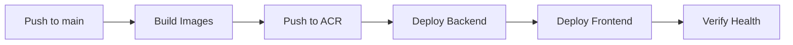

# Show Me The Money 💰

[](https://github.com/dotnetpower/showmethemoney/actions/workflows/deploy-azure.yml)
[](https://opensource.org/licenses/MIT)
[](https://www.python.org/downloads/)
[](https://nodejs.org/)
[](https://fastapi.tiangolo.com/)
[](https://reactjs.org/)
[](https://www.typescriptlang.org/)
[](https://github.com/psf/black)
[](https://github.com/astral-sh/ruff)
[](https://azure.microsoft.com/services/container-apps/)

> ETF 및 주식 종목 데이터를 수집, 저장, 시각화하는 대시보드 애플리케이션

## 📋 목차

- [주요 기능](#-주요-기능)
- [기술 스택](#-기술-스택)
- [프로젝트 구조](#-프로젝트-구조)
- [빠른 시작](#-빠른-시작)
- [API 문서](#-api-문서)
- [ETF 크롤러 현황](#-etf-크롤러-현황)
- [배포](#-배포)
- [기여 가이드](#-기여-가이드)
- [라이선스](#-라이선스)

## ✨ 주요 기능

### 📊 ETF 데이터 관리
- **전체 ETF 조회**: 14개 운용사, 3,600개 이상의 ETF 데이터 수집 및 관리
- **운용사별 필터링**: iShares, Vanguard, SPDR 등 주요 운용사별 ETF 목록 조회
- **자동 데이터 업데이트**: 스케줄러를 통한 주기적 데이터 갱신

### 💹 배당 정보 (개발 예정)
- 요일별/월별 배당금 지급 종목 조회
- 배당률 기반 종목 필터링
- 배당 캘린더 제공

### 📈 시각화 대시보드
- 실시간 ETF 가격 및 지표 조회
- 차트 및 그래프를 통한 데이터 시각화
- 반응형 UI로 모바일/데스크탑 지원

### 🗄️ GitHub as Database
- GitHub 리포지토리를 데이터 저장소로 활용
- JSON/MessagePack 형식 지원
- 4MB 이상 대용량 데이터 자동 분할 저장

## 🛠️ 기술 스택

### Backend
| 기술 | 버전 | 설명 |
|------|------|------|
| Python | 3.13+ | 런타임 환경 |
| FastAPI | 0.100+ | 비동기 웹 프레임워크 |
| uv | 최신 | 패키지 관리 |
| Pydantic | v2 | 데이터 검증 |
| APScheduler | 3.10+ | 작업 스케줄러 |
| BeautifulSoup4 | 4.12+ | 웹 크롤링 |
| MessagePack | 1.1+ | 바이너리 직렬화 |

### Frontend
| 기술 | 버전 | 설명 |
|------|------|------|
| React | 18.3+ | UI 라이브러리 |
| TypeScript | 5.5+ | 타입 안전성 |
| Vite | 5.4+ | 빌드 도구 |
| Axios | 1.7+ | HTTP 클라이언트 |
| Recharts | 2.12+ | 차트 라이브러리 |

### Infrastructure
| 기술 | 설명 |
|------|------|
| Azure Container Apps | 컨테이너 호스팅 |
| Azure Container Registry | Docker 이미지 저장소 |
| Azure Application Insights | 모니터링 및 로깅 |
| GitHub Actions | CI/CD 파이프라인 |

## 📁 프로젝트 구조

```
showmethemoney/
├── backend/                 # FastAPI 백엔드
│   ├── app/
│   │   ├── api/             # API 라우터 (v1 엔드포인트)
│   │   ├── core/            # 설정, 보안, 로깅
│   │   ├── db/              # GitHub 파일시스템 DB 헬퍼
│   │   ├── models/          # Pydantic 모델
│   │   ├── services/        # 비즈니스 로직 및 크롤러
│   │   │   └── crawlers/    # 운용사별 ETF 크롤러
│   │   └── main.py          # FastAPI 엔트리포인트
│   ├── tests/               # pytest 테스트
│   └── Dockerfile
├── frontend/                # React 프론트엔드
│   ├── src/
│   │   ├── components/      # 재사용 컴포넌트
│   │   ├── pages/           # 페이지 컴포넌트
│   │   ├── hooks/           # 커스텀 훅
│   │   ├── services/        # API 연동 모듈
│   │   └── context/         # React Context
│   └── Dockerfile
├── data/                    # GitHub 기반 JSON 저장소
├── docs/                    # 프로젝트 문서
├── infra/                   # Azure 인프라 (Bicep)
├── scripts/                 # 유틸리티 스크립트
├── docker-compose.yml       # 로컬 개발 환경
└── pyproject.toml           # Python 프로젝트 설정
```

## 🚀 빠른 시작

### 사전 요구사항

- Python 3.13+
- Node.js 20+
- [uv](https://github.com/astral-sh/uv) (Python 패키지 관리자)
- Docker (선택사항)

### 백엔드 실행

```bash
# 가상환경 생성 및 활성화
uv venv --python 3.13 .venv
source .venv/bin/activate

# 의존성 설치
uv sync

# 서버 실행
uvicorn backend.app.main:app --reload
```

### 프론트엔드 실행

```bash
cd frontend
npm install
npm run dev
```

### Docker Compose (권장)

```bash
# 전체 서비스 빌드 및 실행
docker compose up --build

# 백그라운드 실행
docker compose up -d
```

### 환경 변수 설정

`.env.example` 파일을 복사하여 `.env` 파일을 생성하고 필요한 값을 설정하세요:

```bash
cp .env.example .env
```

주요 환경 변수:
- `APPLICATIONINSIGHTS_CONNECTION_STRING`: Application Insights 연결 문자열
- `GITHUB_TOKEN`: GitHub API 토큰 (데이터 저장용)
- `GITHUB_REPO_OWNER`: GitHub 리포지토리 소유자
- `GITHUB_REPO_NAME`: GitHub 리포지토리 이름

## 📖 API 문서

서버 실행 후 다음 URL에서 대화형 API 문서를 확인할 수 있습니다:

| 문서 | URL | 설명 |
|------|-----|------|
| Swagger UI | http://localhost:8000/docs | 대화형 API 테스트 |
| ReDoc | http://localhost:8000/redoc | 읽기 전용 API 문서 |
| OpenAPI Schema | http://localhost:8000/openapi.json | OpenAPI 3.0 스키마 |

### 주요 API 엔드포인트

#### ETF 조회
| Method | Endpoint | 설명 |
|--------|----------|------|
| `GET` | `/api/v1/etf/all` | 전체 ETF 조회 (3,600개+) |
| `GET` | `/api/v1/etf/list/{provider}` | 특정 운용사 ETF 조회 |
| `GET` | `/api/v1/etf/list` | 운용사별 ETF 목록 |

#### 데이터 관리
| Method | Endpoint | 설명 |
|--------|----------|------|
| `POST` | `/api/v1/etf/update` | 전체 데이터 업데이트 |
| `POST` | `/api/v1/etf/update/{provider}` | 특정 운용사 업데이트 |

#### 시스템
| Method | Endpoint | 설명 |
|--------|----------|------|
| `GET` | `/api/v1/etf/scheduler/status` | 스케줄러 상태 조회 |
| `GET` | `/health` | 헬스 체크 |

## 🔍 ETF 크롤러 현황

### ✅ 정상 작동 (14개 운용사)

총 **3,666개 ETF** 데이터 수집 중

| 운용사 | ETF 수 | 상태 |
|--------|--------|------|
| FirstTrust | 1,572 | ✅ |
| iShares | 513 | ✅ |
| Direxion | 484 | ✅ |
| Invesco | 240 | ✅ |
| GlobalX | 204 | ✅ |
| SPDR | 176 | ✅ |
| Vanguard | 102 | ✅ |
| Franklin Templeton | 95 | ✅ |
| JPMorgan | 68 | ✅ |
| Goldman Sachs | 48 | ✅ |
| Pacer Advisors | 47 | ✅ |
| Roundhill | 45 | ✅ |
| Dimensional Fund Advisors | 41 | ✅ |
| PIMCO | 23 | ✅ |
| Alpha Architect | 8 | ✅ |

### ⚠️ 수정 필요 (5개 운용사)

| 운용사 | 이슈 | 해결 방안 |
|--------|------|-----------|
| Fidelity | 웹사이트 구조 변경 | React/JS 동적 렌더링 필요 |
| GraniteShares | 크롤러 로직 점검 필요 | 로직 수정 필요 |
| VanEck | 크롤러 로직 점검 필요 | 로직 수정 필요 |
| WisdomTree | 403 Forbidden | User-Agent 및 헤더 조정 |
| Yieldmax | JS 렌더링 필요 | Playwright/Selenium 사용 |

> 📌 자세한 크롤러 정보는 [README_ETF_CRAWLER.md](./README_ETF_CRAWLER.md)를 참조하세요.

## 🚢 배포

### GitHub Actions를 통한 자동 배포 (권장)

`main` 브랜치에 push하면 Azure Container Apps에 자동으로 배포됩니다.



### 필요한 GitHub Secrets

| Secret | 설명 | 필수 |
|--------|------|------|
| `AZURE_CREDENTIALS` | Azure 서비스 주체 JSON | ✅ |
| `GH_TOKEN` | GitHub Personal Access Token | ✅ |
| `ACR_NAME` | Azure Container Registry 이름 | ✅ |
| `ACR_LOGIN_SERVER` | ACR 로그인 서버 (예: acrshowmethemoney.azurecr.io) | ✅ |

> ⚠️ **중요**: 기존 Azure Container Registry를 사용합니다. 새로운 ACR을 생성하지 않으므로, 반드시 `ACR_NAME`과 `ACR_LOGIN_SERVER` secrets를 설정해야 합니다.

> 📌 자세한 배포 가이드는 [docs/QUICKSTART.md](./docs/QUICKSTART.md)를 참조하세요.

## 🧪 테스트

```bash
# 가상환경 활성화
source .venv/bin/activate

# 테스트 실행
pytest -v

# 특정 테스트 실행
pytest backend/tests/test_users.py -v

# 커버리지 포함
pytest --cov=backend/app -v
```

## 📊 모니터링

### Application Insights

- `.env` 파일에 `APPLICATIONINSIGHTS_CONNECTION_STRING` 설정 시 자동으로 트레이스 수집
- FastAPI 및 HTTPX에 OpenTelemetry 인스트루멘테이션 기본 적용
- Azure Portal에서 실시간 로그 및 메트릭 확인 가능

### 데이터 저장 전략

| 환경 | 포맷 | 특징 |
|------|------|------|
| 개발 | JSON | 가독성 좋음, 디버깅 용이 |
| 운영 | MessagePack | 30-50% 압축, 성능 우수 |

- `data/` 디렉터리가 GitHub 저장소를 DB로 사용하는 진입점
- 4MB 초과 시 자동 분할 저장
- 메타데이터를 별도 파일로 관리

## 🤝 기여 가이드

기여를 환영합니다! 다음 단계를 따라주세요:

1. **Fork** 저장소를 Fork합니다
2. **Branch** 기능 브랜치를 생성합니다 (`git checkout -b feature/amazing-feature`)
3. **Commit** 변경사항을 커밋합니다 (`git commit -m 'Add amazing feature'`)
4. **Push** 브랜치에 Push합니다 (`git push origin feature/amazing-feature`)
5. **PR** Pull Request를 생성합니다

### 코드 스타일

- Python: [Black](https://github.com/psf/black) + [Ruff](https://github.com/astral-sh/ruff)
- TypeScript: ESLint + Prettier

```bash
# Python 포맷팅
black backend/
ruff check backend/

# TypeScript 린팅
cd frontend && npm run lint
```

## 📅 로드맵

- [x] ETF 데이터 크롤러 구현 (14/19 운용사)
- [x] Azure Container Apps 배포 파이프라인
- [ ] 나머지 5개 운용사 크롤러 수정
- [ ] 배당 정보 크롤링 및 캘린더
- [ ] 실시간 가격 업데이트
- [ ] MessagePack 직렬화 최적화
- [ ] React 대시보드 고도화

## 📄 라이선스

이 프로젝트는 MIT 라이선스 하에 배포됩니다. 자세한 내용은 [LICENSE](./LICENSE) 파일을 참조하세요.

## 📞 문의

- **GitHub Issues**: [이슈 등록](https://github.com/dotnetpower/showmethemoney/issues)
